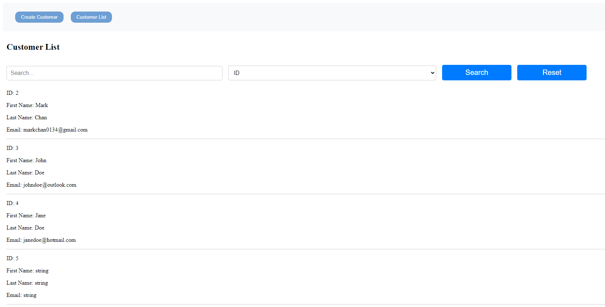

Frontend : AngularJS  
Web API : ASP.NET Core 8.0  
Database : MSSQL

# Customer Management UI Documentation  
## Overview
Simple AngularJS UI implementing two pages, `customer-form` and `customer-list`.
### Screencaps
`Customer Form`

`Customer List`


## CustomHttpService

Custom service to provide a simplified interface to making HTTP requests to Web API.

### Dependencies
* `HttpClient`: Built in Angular mechanism to communicate with remote server over HTTP

### Properties
* `_apiUrl`: Base URL of the Web API
* `_apiKey`: API key needed to authenticate requests

### Methods
`constructor(http: HttpClient)`  
The constructor takes and stores a `HttpClient` for later use.

`request(method: string, endpoint: string, body?: any): Observable<any>`  
Private method that sends an HTTP request to the API. It takes the HTTP method, the endpoint, and optionally a body for the request. It sets the 'x-api-key' and 'access-control-allow-origin' headers for the request. It returns an Observable that will emit the response from the server.

`get(endpoint: string, body: any = {}): Observable<any>`  
Sends a GET request to the API. It takes the endpoint and optionally a body for the request. It calls the request method with 'GET' as the method. It returns an Observable that will emit the response from the server.

`post(endpoint: string, body: any): Observable<any>`  
Sends a POST request to the API. It takes the endpoint and a body for the request. It calls the request method with 'POST' as the method. It returns an Observable that will emit the response from the server.  

## CustomerService
Angular service providing methods to interact with Customer Management API.  

### Dependencies
* `CustomHttpClientService`: Custom service to provide a simplified interface to making HTTP requests to Web API.

### Methods
`constructor(http: CustomHttpClientService)`  
Takes a `CustomHttpClientService` and stores for later use.  

`getCustomers(): Observable<Customer[]>`
Retrieves all customers through the API by sending a GET request to base API URL. Returns an `Observable` that will emmit array of `Customer` object.

`getCustomersById(): Observable<Customer[]>`  
Retrieves a customer by their ID through the API by sending a GET request to base API URL to the `byId/{id}` endpoint. Returns an `Observable` that will emmit a `Customer` object.  

`getCustomersByCriteria(criteriaType: string, criteriaValue: string): Observable<Customer[]>`  
Retrieves customers based on a search criteria through the API by sending a GET request to base API URL to the `byCriteria` endpoint - accepting <b>criteriaType</b> and <b>criteriaValue</b> as the query parameters. Returns an `Observable` that will emmit a `Customer` object.  

# Customer Management API Documentation  
### Overview  
This Customer Management API is a RESTful API built with ASP.NET Core 8.0.

Dependency Injection concept referencing https://learn.microsoft.com/en-us/aspnet/core/fundamentals/dependency-injection?view=aspnetcore-8.0  


## CustomerController  
The `CustomerController` is the main controller of the API. It handles all the HTTP requests related to customers. 

### Endpoints  
* `GET /api/Customer` : Returns a list of all customers.  
Example:
```
GET /api/Customer
Response:
[
    {
        "id": 2,
        "firstName": "John",
        "lastName": "Doe",
        "email": "johndoe@gmail.com"
    },
    ...
]
```

* `GET /api/Customer/byId/{id}` : 
Returns a customer by their ID. If the customer is not found, it returns a 404 status code.
```
GET api/Customer/byId/{id}
Response:
{
    "id": 2,
    "firstName": "John",
    "lastName": "Doe",
    "email": "johndoe@gmail.com"
}
```

* `GET /api/Customer/byCriteria` : 
Returns a list of customers based on a search criteria. The search criteria type and value are provided as query parameters (criteriaType and criteriaValue). If no customers match the criteria, it returns a 404 status code. If the criteria type or value are not provided, it returns a 400 status code.
```
GET /api/Customer/byCriteria?criteriaType=firstname&criteriaValue=john
Response:
[
    {
        "id": 2,
        "firstName": "John",
        "lastName": "Doe",
        "email": "johndoe@gmail.com"
    },
    ...
]
```

* `POST /api/Customer`
Creates a new customer. The customer data is provided in the request body. After the customer is created, it returns a 201 status code and the created customer. 
```
Request body (JSON):
{
    "firstName": "New",
    "lastName": "User",
    "email": "newuser@email.com"
}
Response:
{
    "id": X,
    "firstName": "New",
    "lastName": "User",
    "email": "newuser@email.com"
}
```

## Models
`Customer`  
Represents a customer in the system. Contains properties such as id, firstname, lastname, and email.

## ICustomerSearchCriteria Implementations  
The `ICustomerSearchCriteria` interface is implemented by several classes to provide different search criteria for customers. Each class takes a specific value in its constructor and applies it to a query in the Apply method.

* `EmailCriteria`  
Searches for customers by email. The Apply method filters the query to include only customers whose email matches the provided email.
 
* `FirstNameCriteria`  
Searches for customers by first name. The Apply method filters the query to include only customers whose first name matches the provided first name.

* `LastNameCriteria`  
Searches for customers by last name. The Apply method filters the query to include only customers whose last name matches the provided last name.

## CriteriaFactory  
The `CriteriaFactory` class is a factory that creates instances of `ICustomerSearchCriteria` based on a provided criteria type and value. The Create method uses a switch statement to create the appropriate criteria object based on the criteria type. If the criteria type is not recognized, it throws an ArgumentException.

### Methods
`Create(string criteriaType, string criteriaValue)`  
Creates an instance of ICustomerSearchCriteria based on the provided criteria type and value. The criteria type is expected to be one of the following: "email", "firstname", "lastname". If it's not, an ArgumentException is thrown. The created criteria object is returned.  

# Customer Management Tests (CustomerControllerTests) Documentation

### Overview
`CustomerControllerTests` is a set of unit tests for the CustomerController class in CustomerManagement.Api. Testing mainly `GetByCriteria` function.

## CustomerControllerTests

### Test Cases
`GetByCriteria_ReturnsOkResult_WithValidCriteria()`  
Test to verify that `GetByCriteria` method in `CustomerController` returns an `OkObjectResult` with list of `Customer` objects when given valid criteria.

`GetByCriteria_ReturnsNotFoundResult_WhenNoMatchingCriteria()`  
Test to verify that `GetByCriteria` method in `CustomerController` returns `NotFoundResult` when no customers match the given criteria.

`GetByCriteria_ReturnsBadRequest_WhenInvalidCriteria()`  
Test to verify that `GetByCriteria` method in `CustomerController` returns a `BadRequestObjectResult` when given invalid criteria.

`GetByCriteria_ReturnsOkResult_WithFirstNameCriteria()`  
Test to verify that `GetByCriteria` method in `CustomerController` returns an
`OkObjectResult` with list of `Customer` objects when given valid criteria.

# Customer Management Database Documentation

### Overview
The database is a Microsoft SQL Database generated through Entity Framework Migrations. The database consists of one `Customers` table and one `_EFMigrationsHistory` table.

## Scripts

The scripts for tables:

`Customers`
```
CREATE TABLE [dbo].[Customers](
	[Id] [int] IDENTITY(1,1) NOT NULL,
	[FirstName] [nvarchar](max) NOT NULL,
	[LastName] [nvarchar](max) NOT NULL,
	[Email] [nvarchar](max) NOT NULL,
 CONSTRAINT [PK_Customers] PRIMARY KEY CLUSTERED 
(
	[Id] ASC
)WITH (PAD_INDEX = OFF, STATISTICS_NORECOMPUTE = OFF, IGNORE_DUP_KEY = OFF, ALLOW_ROW_LOCKS = ON, ALLOW_PAGE_LOCKS = ON, OPTIMIZE_FOR_SEQUENTIAL_KEY = OFF) ON [PRIMARY]
) ON [PRIMARY] TEXTIMAGE_ON [PRIMARY]
GO
```  

`_EFMigrationsHistory`
```
CREATE TABLE [dbo].[__EFMigrationsHistory](
	[MigrationId] [nvarchar](150) NOT NULL,
	[ProductVersion] [nvarchar](32) NOT NULL,
 CONSTRAINT [PK___EFMigrationsHistory] PRIMARY KEY CLUSTERED 
(
	[MigrationId] ASC
)WITH (PAD_INDEX = OFF, STATISTICS_NORECOMPUTE = OFF, IGNORE_DUP_KEY = OFF, ALLOW_ROW_LOCKS = ON, ALLOW_PAGE_LOCKS = ON, OPTIMIZE_FOR_SEQUENTIAL_KEY = OFF) ON [PRIMARY]
) ON [PRIMARY]
GO
```

## Table structures
`Customer`  
| Column Name | Data Type | 
| ------------- |:-------------:|
|Id |int |
|FirstName |nvarchar(MAX) |
|LastName| nvarchar(MAX) | 
|Email | nvarchar(MAX) | 

`_EFMigrationsHistory_`  
| Column Name | Data Type | 
| ------------- |:-------------:|
|MigrationId |nvarchar(150) |
|ProductVersion |nvarchar(32) | 

